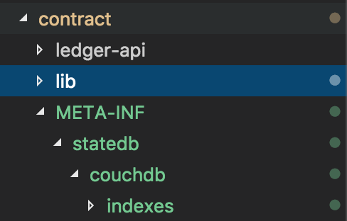
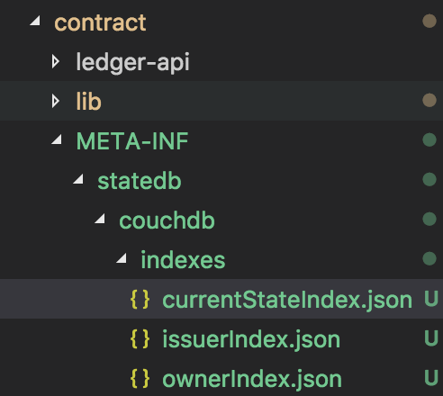
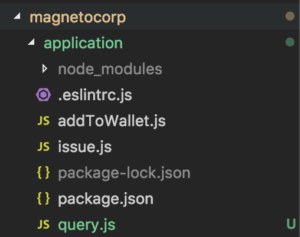

## Querying the World State

In this section we will take a look at how you can query the world state of a channel within Hyperledger Fabric. Before we jump into showing how to query the world state, we first need to understand what database indexes are and how they can help us with queries.

### What are database indexes?

In order to understand indexes, let's take a look at what happens when you query the world state. Say, for example, you want to find all assets owned by the user, "Bob". The database will search through each json document in the database one by one and return all documents that match user = "bob. This might not seem like a big deal but consider if you have millions of documents in your database. These queries might take a while to return the results as the database needs to go through each and every document. With indexes you create a reference that contains all the values of a specific field and which document contains that value. What this means is that instead of searching through every document, the database can just search the index for occurences of the user "bob" and return the documents that are referenced. 

It's important to note that every time a document is added to the database the index needs to be updated. Normally in CouchDB this is done when a query is received but in Hyperledger Fabric the indexes are updated every time a new block is committed which allows for faster querying. This is a process known as **index warming**.

1. Think of different queries that are needed for the application to function
The first step in building an index is understanding what queries are commonly run. Once we understand what queries are important to the application, then we can decide on what fields to include in the index.

In the commercial paper use case we will be querying by issuer, by owner, and by the current state of each asset.

#### Create indexes for those commonly used queries

1. First, create a directory under the **contract** directory of magnetocorp and name the new directory **META-INF**.
2. Then, in the new directory, create another new directory named **statedb**
3. After that, create a new directory inside of **statedb** called **couchdb**
4. Next, you guessed it, create a new directory inside of **couchdb** and name it **indexes**

The directory structure should look like the image below.



1. Now we can start creating our index definitions. Create a new file in the **indexes** directory and name it **issuerIndex.json**
2. Then, copy the following code into that file:

```javascript
{
    "index": {
        "fields": [ "issuer"]
    },
    "ddoc": "issuerIndexDoc",
    "name": "issuerIndex",
    "type": "json"
}
```

This file states that the index will:
- keep track of the *issuer* field of each document
- store this index in a design document (ddoc) named *issuerIndexDoc*
 - is named issuerIndex
- will be in json format

Now let's create two more.

3. Create a new file in the **indexes** directory and name it **ownerIndex.json**
4. Then, copy the following code into that file:

```javascript
{
    "index": {
        "fields": ["owner"]
    },
    "ddoc": "ownerIndexDoc",
    "name": "ownerIndex",
    "type": "json"
}
```

This index is very similar to the previous one for the issuer field but instead we are indexing the *owner* field.

5. Finally, create one last file in the **indexes** directory and name it **currentStateIndex.json**
6. Then, copy the following code into that file:

```javascript
{
    "index": {
        "fields": [ "currentState"]
    },
    "ddoc": "currentStateIndexDoc",
    "name": "currentStateIndex",
    "type": "json"
}
```

Your directory structure should now look like this:



And that's all it takes to build indexes. These indexes will be deployed next time the smart contract is installed and instantiated.

#### Implement query transactions in the smart contract

Now we need to implement the query logic in the transactions of the smart contract. These transactions will be invoked by the Node SDK to execute our queries.

1. Take the **papercontract.js** from this repo and replace the **papercontract.js** that comes with the commercial paper example from the *fabric-samples* repo. 

This updated contract already has the query logic added. Let's take a look at the transactions that were added.

- queryByIssuer, queryByOwner, and queryByCurrentState - These transactions are all similar in that they take one parameter and query the respective fields in the database. If you look at the *queryString* for each transaction, you will notice that they are pointing to the design documents that hold the indexes that were created earlier. This query string is then passed to *queryWithQueryString* to be executed.

- queryAll - This transaction does what it says. It gets all asset states from the world state database. This query string is then passed to *queryWithQueryString* to be executed.

- queryWithQueryString - This function receives a query string as a parameter and is called by other transactions in the contract to do the actual querying. You can also do ad hoc queries with this transaction by passing in your own query strings.

#### Implement application code to query the world state

With our indexes and query transactions built, all we need to do now is utilize the Node SDK to execute the queries.

1. This repo contains a javascript file that can be used to invoke the queries. Copy over **query.js** from this repo into the *application* directory of magnetocorp in the commercial paper example.



This file will create the connection to our local blockchain network and invoke a query transaction to be evaluated. The results will be returned as a buffer with which this file converts to a JSON object.

Quick note about this file: If you look closely at line 67 you can see the method "evaluateTransaction" is being called to invoke the query transaction instead of the "submitTransaction" method. This method allows the application to query the world state of a peer without submitting a transaction propsal to be committed. This method is really only used for the purpose of querying as it does not write to the ledger.


2. If you haven't already, run the following command in your terminal from inside the *application* directory:

```bash
npm install
```

3. Run the following to test *query.js*
```bash
node query.js
```


4. The query that comes with *query.js* is the *queryAll* transaction. Let's try out some other queries. Locate the **commands.txt** file from this repo.

5. Copy the line under **Query issuer** and paste it into line 67 of *query.js*, replacing the line that was there before.

6. Save the file and run *node query.js* again.

7. Go back into commands.txt and copy the line under **Query owner** and paste it into line 67 of *query.js*, replacing the line that was there before.

8. Save the file and run *node query.js* again.

9. Lastly, go back into commands.txt and copy the line under **Query currentState** and paste it into line 67 of *query.js*, replacing the line that was there before.

10. Save the file and run *node query.js* again.


### Recap of querying
In this section we took a look at how querying works in a Hyperledger Fabric network with CouchDB as the state database. First, we created indexes for commonly used queries. Then, we added the query logic to the smart contract. Finally, we utilized the Node SDK for interacting with Hyperledger Fabric in a javascript file to evaluate the queries defined in the smart contract. 


[<< Prev (App transactions)](LoopbackApp.md)        &nbsp;&nbsp;&nbsp;&nbsp;&nbsp;&nbsp;&nbsp;&nbsp;&nbsp;&nbsp;
[>> Next (Loopback app)](LoopbackApp.md)