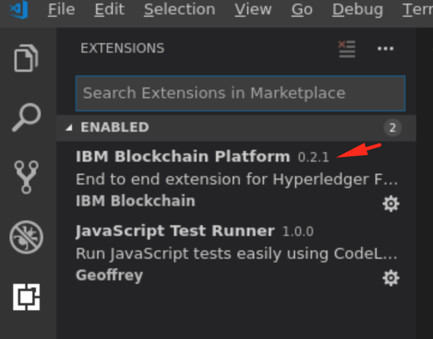
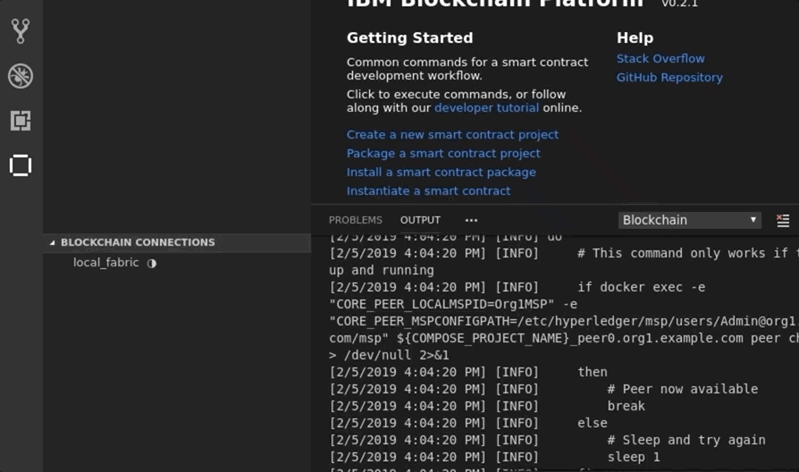
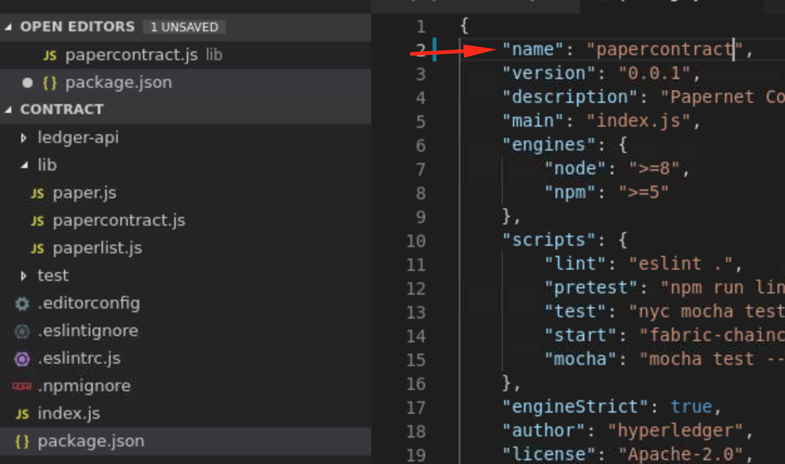
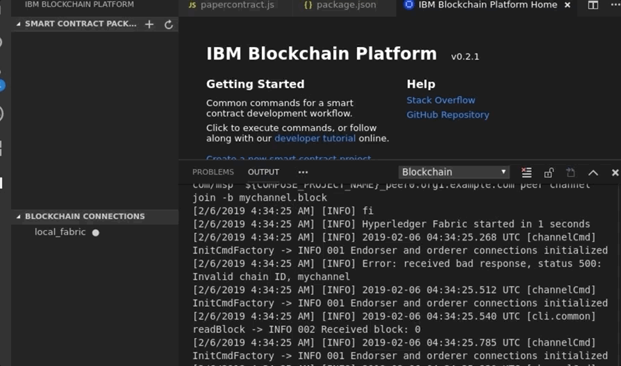
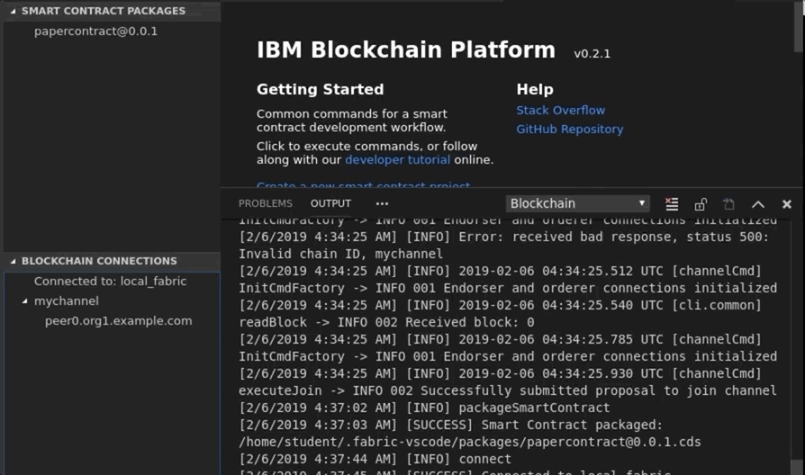
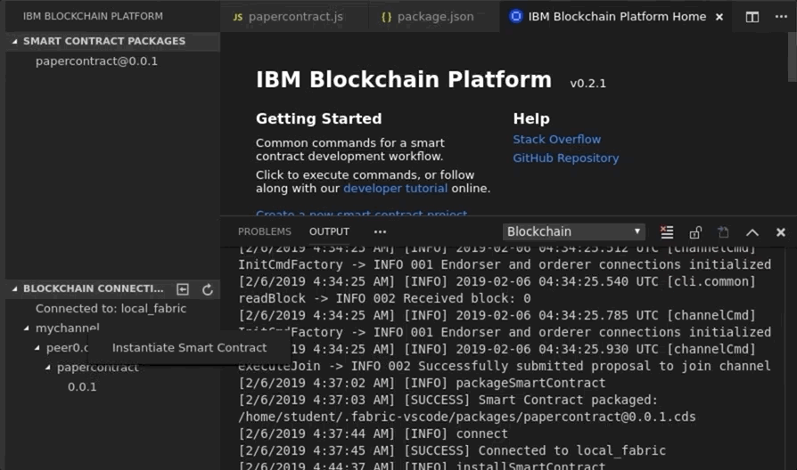
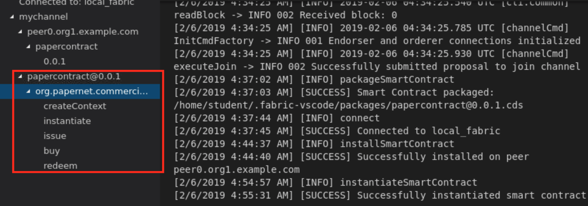
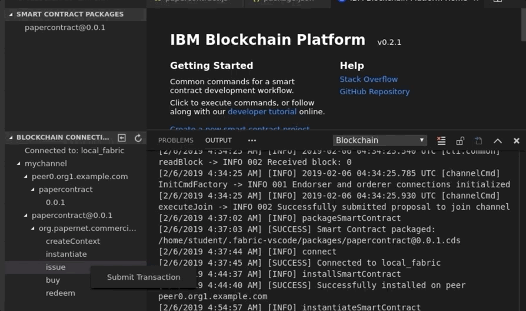
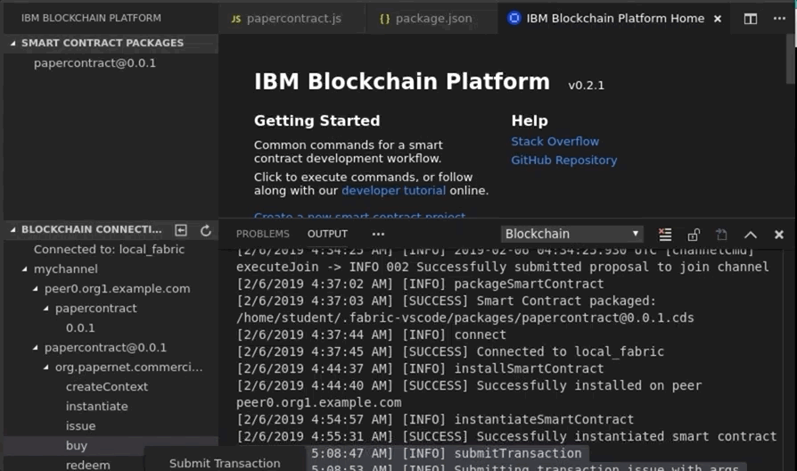
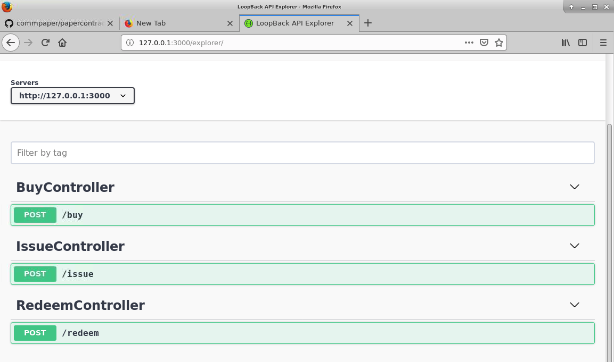

## Think 2019 - Master class
### Designing and developing Blockchain networks using Hyperledger Fabric 1.4

This hands-on lab walks you through the following:
1. Setup a development environment using the IBM Blockchain Platform Extension for VS Code. 
2. Develop, deploy and run smart contracts using the new programming model in 1.4. 
3. Build a client application using the Node.js SDK and submit transactions to the deployed smart contract.

[Prerequisites](Prerequisites.md)

Estimated time: <br />
After the prerequisites are installed, this should take approximately 60 minutes to complete.

[](#setup)
### 1. Setup Fabric Development environment 
(using the IBM Blockchain Platform Extension for VS Code.)<br />
#### Step 1. 
Start VS Code by running the command `code` from the terminal. 
IBM Blockchian extension for VS Code is preinstalled for you in this VM. Verify the installation under the Extensions view.   


Notice the IBM Blockchain platform icon on the side bar.
#### Step 2.  
Start a local fabric envioronemnt.
Goto the Blockchain platfrom view and click on `local_fabric` under BLOCKCHAIN CONNECTIONS



Your environment is now ready for the tutorial!


### 2. Develop, deploy and run smart contracts. 
#### Step 1.
In VSCode, choose File > Open Folder, and select the contracts folder by navigating to the  `$HOME/fabric-samples/commercial-paper/organization/magnetocorp/contract directory`. This is your top-level project folder for this tutorial. 

#### Step 2.
Explore the `papercontract.js` file, which is located in the lib subfolder. It effectively orchestrates the logic for the different smart contract transaction functions (issue, buy, redeem, etc.), and is underpinned by essential core functions (in the sample contract) that interact with the ledger. The link provided in the introduction section above explains the concepts, themes, and programmatic approach to writing contracts using the commercial paper scenario. Take some time to read that explainer and then resume here.

#### Step 3.
Open package.json and rename the contract to `papercontract`. Save the file.


#### Step 4.
Package the contract.
Click on the IBM Blockchain Platform sidebar icon. When you do this the first time, you may get a message that the extension is “activating” in the output pane.

Click on the `+` symbol (`Add a new package`), under the `Smart Contract packages` panel, to package up the commercial paper smart contract package for installing onto a peer. It will be called something like  `papercontract@0.0.1`.



#### Step 5.
Install the contract.
Right click on the peer and select `Install Smart Contract`. Select `papercontract@0.0.1` from the selection list.

Installed contract should appear as shown below:


#### Step 6.
Instantiate the contract
Right click on `mychannel` and select `Install Smart Contract`. Select the contract `papercontract@0.0.1` from the list. 

Instantiated contract should appear as shown below:

Notice all the transaction methods (issue, buy, redeem).

#### Step 7.
Run an `issue` transaction.
Right click on `issue` method and select `Submit Transaction`. 
Use the following data for the method arguments:
```
MagnetoCorp,00006,2020-05-31,2020-11-30,5000000
```

The screenshot below shows a successful completion of `issue` transaction.


#### Step 8.
Run the `buy` transaction
Right click on the `buy` method and select `Submit Transaction`. Use the following data for the method arguments:
```
MagnetoCorp,00001,MagnetoCorp,DigiBank,4900000,2020-05-31
```

The screenshot below show a successful `buy` transaction.


Query the blockchain using the query.js file. Run the queryAll function.

#### Step 9.
The last `redeem` transaction will be run using the Commercial Paper Loopback app - see below. 

### 3. Build a client application using Loopback 4 and Hyperledger Fabric Node.js SDK 
At this point, we will use a client application generated with Loopback 4 (a tool for building APIs)
to interact with our paper contract. The last transaction we will submit, the `redeem` transaction, will
be submitted using the client app.

#### Step 1.
In VSCode, choose File > Open Folder, and select the `commercialPaperLoopback` folder by navigating to the `home/student/Desktop/commercialPaperLoopback` directory. Highlight the folder by clicking on it, and then click `add`. This is where you will build and run your client app.

#### Step 2 - Install Dependencies.
Navigate to your `commercialPaperLoopback` folder using terminal. Run npm install - 
```
/Desktop/commercialPaperLoopback $ npm install
```

#### Step 3 - Build and Start the App

```
/Desktop/commercialPaperLoopback $ npm start
```

Navigate to http://127.0.0.1:3000/explorer/ in your browser. You should see something like this: 


#### Step 4 - Submit Transactions Using the App
Under `RedeemController` Click on the green POST button next to /redeem on the left-hand side.

You should see our API's parameters here. Click on the `Try it out` on the right-hand side.


Copy and paste the following JSON in the request body:

{
  "issuer": "MagnetoCorp",
  "paperNumber": "00006",
  "redeemingOwner": "DigiBank",
  "redeemDateTime": "2/13/2019"
}

Click on `Execute`.


